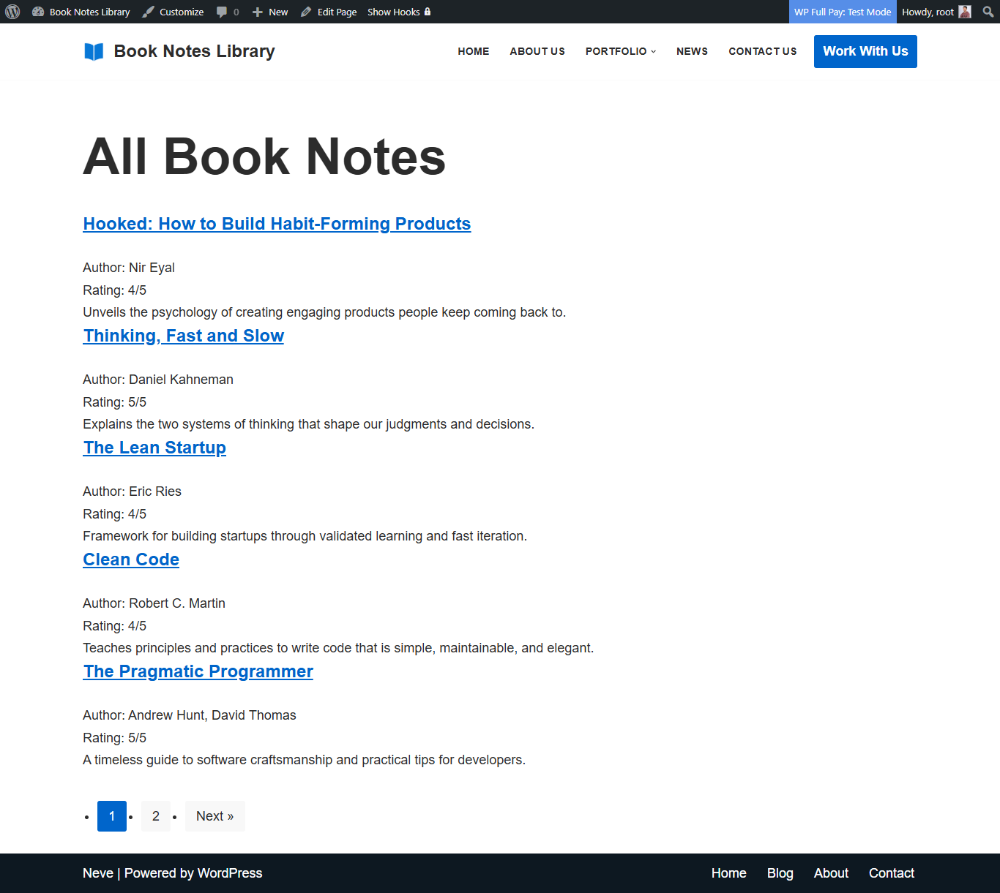

# Book Notes

A simple plugin to manage book notes with custom post types, meta fields, shortcode, settings, and REST API.

## Description

Book Notes lets you add book reviews or notes with custom fields for **Author** and **Rating**.  
You can display them on the front-end using a shortcode and fetch them programmatically using a REST API endpoint.

### Features
- Custom Post Type: `book_note`
- Custom Meta Fields: Author, Rating (1–5)
- Shortcode: `[book_notes min_rating="3" search="keyword"]`
- Settings Page: choose number of notes per page
- REST API: `/wp-json/book-notes/v1/notes?min_rating=4`

## Installation

1. Upload the `book-notes` folder to the `/wp-content/plugins/` directory.
2. Activate the plugin through the 'Plugins' menu in WordPress.
3. Add new Book Notes from the admin menu.
4. Insert `[book_notes]` shortcode into any post or page.

## Frequently Asked Questions

**Q: How do I show only high-rated books?**  
Use `[book_notes min_rating="4"]` to show only notes with rating 4 or above.

**Q: How do I change items per page?**  
Go to **Settings → Book Notes** and set the number.

## Screenshots

1. Admin add Book Notes page  
   

2. Admin Book Notes list page  
   

3. Book Notes list page  
   

4. Settings page  
   

## Changelog

### 1.0.0
- Initial release with CPT, meta fields, shortcode, settings page, and REST API.

## Upgrade Notice

### 1.0.0
First stable release.

## License

This plugin is free software; you can redistribute it and/or modify it under the terms of the [GPLv2 or later](https://www.gnu.org/licenses/gpl-2.0.html).
